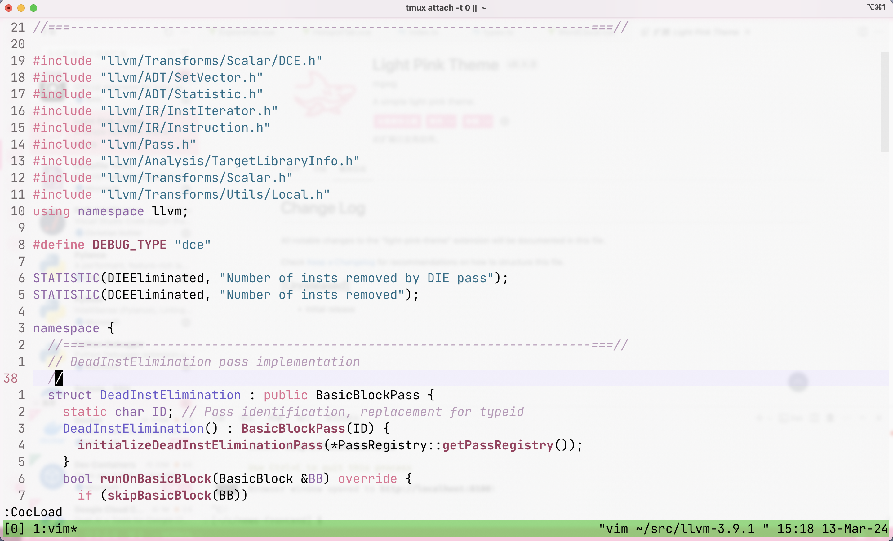

# light-pink-theme

A Vim/Neovim light color scheme reproduction of [the same name vscode theme](https://github.com/mgwg/light-pink-theme/).

## Installation

Just clone this repo and add the .vim file into your `~/.vim/colors` directory.

## Configuration

Add the following to your `.vimrc`:

```vim
colorscheme light-pink
```

## Example



## Contribute

Since I primarily focus on C/C++, and Python (with limited proficiency in the latter), I welcome contributions for other languages. Additionally, feel free to submit pull requests that can enhance this color scheme.

## Credit

[mgwg-light-pink-theme](https://github.com/mgwg/light-pink-theme)

[viniciusmuller-djanho](https://github.com/viniciusmuller/djanho)

## License
[MIT](./LICENSE)
