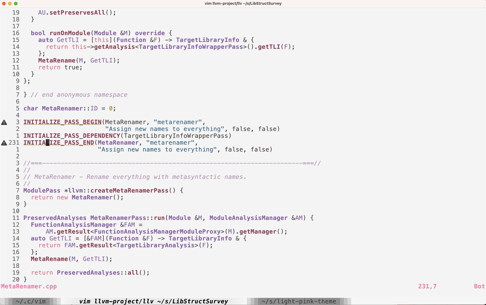

# light-pink-theme

A Vim (vim9 and legacy viml) light color scheme reproduction of [the same name vscode theme](https://github.com/mgwg/light-pink-theme/).

## Installation

Just clone this repo and add the .vim file into your `~/.vim/colors` directory.

If vim9script is not available, you can use the legacy branch.

## Configuration

Add the following to your `.vimrc`:

```vim
colorscheme light-pink
```

## Example



## Contribute

Feel free to submit pull requests that can enhance this color scheme.

## Credit

[mgwg: light-pink-theme](https://github.com/mgwg/light-pink-theme)

[viniciusmuller: djanho](https://github.com/viniciusmuller/djanho)

## License
[MIT](./LICENSE)
